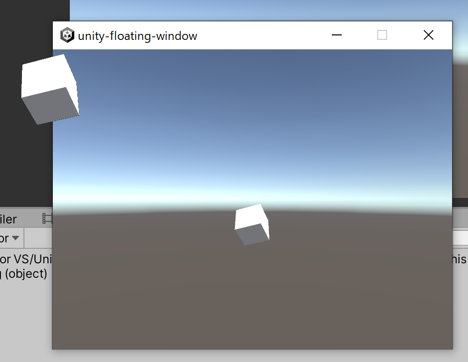

# Unity Floating Image



## 概要

WindowsのFormとして指定のテクスチャを表示します。  
ビルドしたアプリでも動作するのは簡単には確認していますが、すべての環境で動作することは保証出来ません。

## インストール
upmで以下のURLでパッケージのインストールが出来ます。
```
https://github.com/yazawa-ichio/unity-floating-image.git?path=Packages/jp.yazawa-ichio.unity-floating-image
```

利用には`System.Windows.Forms.dll`と`System.Drawing.dll`が必要になります。  
Unityのインストールフォルダから取得できます。  
もしくはPackage内のFromDLL.unitypackageからインストール可能です。  


## 実行

FloatingImageを任意のテクスチャを設定します。
削除する場合はDisposeを実行してください。


```cs
public class WindowSample : MonoBehaviour
{
	[SerializeField]
	RenderTexture m_RenderTexture;

	FloatingImage m_FloatingImage;

	void Start()
	{
		m_FloatingImage = new FloatingImage(m_RenderTexture);
		m_FloatingImage.IsDragable = true;
	}

	void OnDestroy()
	{
		m_FloatingImage.Dispose();
	}
}
```